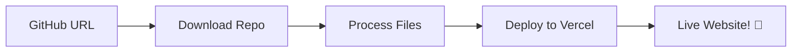

# 🚀 RepoDeploy - Real GitHub Repository Deployment Platform

<div align="center">
  


**A modern deployment platform that actually deploys your GitHub repositories to live, accessible websites**

[🚀 Live Demo](https://your-app.vercel.app) • [📖 Documentation](#-setup-guide) • [💬 Support](#-support)

</div>

---

## ✨ What Makes RepoDeploy Special?

🎯 **Real Deployments** - Not a simulation! Actually deploys your code to live URLs  
⚡ **Lightning Fast** - Deploy any GitHub repo in under 30 seconds  
💰 **100% Free** - Built with free tier services, no paid plans required  
🔄 **Real-Time Updates** - Watch your deployment progress live  
🌐 **Live URLs** - Get actual working websites you can share  
🎨 **Modern Stack** - Next.js 15, Vercel API, Supabase, TypeScript  

## 🎬 How It Works



1. **Paste GitHub URL** → Any public repository
2. **Real-Time Processing** → Download, build, and deploy
3. **Live URL Generated** → Your site is live on the internet
4. **Share & Celebrate** → Working website anyone can visit

## 🚀 Quick Start (5 minutes)

### Prerequisites
- Node.js 18+ installed
- GitHub account
- Vercel account (free)
- Supabase account (free)

### 1-Click Setup

```bash
# Clone the repository
git clone https://github.com/your-username/repodeploy.git
cd repodeploy

# Install dependencies
npm install

# Copy environment template
cp .env.example .env

# Start development server
npm run dev
```

Visit [http://localhost:9002](http://localhost:9002) and start deploying! 🎉

## 🔧 Configuration

### Environment Variables

Create a `.env` file with these values:

```bash
# Supabase Configuration (Free Tier)
NEXT_PUBLIC_SUPABASE_URL=your-supabase-project-url
NEXT_PUBLIC_SUPABASE_ANON_KEY=your-supabase-anon-key

# GitHub Integration
GITHUB_TOKEN=your-github-personal-access-token

# Deployment Mode ('simulation' or 'vercel')
DEPLOYMENT_MODE=vercel

# Vercel Integration (for real deployments)
VERCEL_TOKEN=your-vercel-api-token
```

### Where to Get These Values:

| Service | How to Get |
|---------|-----------|
| **Supabase** | [Create project](https://supabase.com) → Settings → API |
| **GitHub Token** | [Settings](https://github.com/settings/tokens) → Generate new token → `public_repo` scope |
| **Vercel Token** | [Dashboard](https://vercel.com/dashboard) → Settings → Tokens → Create |

## 🏗️ Architecture

```
┌─────────────────┐    ┌──────────────────┐    ┌─────────────────┐
│   Next.js App   │───▶│   Vercel API     │───▶│  Live Website   │
│   (Frontend)    │    │  (Deployment)    │    │   (Result)      │
└─────────────────┘    └──────────────────┘    └─────────────────┘
         │                        │
         ▼                        ▼
┌─────────────────┐    ┌──────────────────┐
│   Supabase      │    │   GitHub API     │
│  (Database)     │    │ (Source Code)    │
└─────────────────┘    └──────────────────┘
```

### Tech Stack

| Layer | Technology | Purpose |
|-------|------------|-------|
| **Frontend** | Next.js 15, React, TypeScript | Modern web application |
| **Backend** | Vercel API Routes, Server Actions | Deployment processing |
| **Database** | Supabase PostgreSQL | Deployment tracking |
| **Deployment** | Vercel API | Real website hosting |
| **Source** | GitHub API | Repository access |
| **UI** | Tailwind CSS, Shadcn/ui | Beautiful interface |

## 📊 Features

### 🎯 Core Features
- ✅ **Real GitHub Repository Deployment**
- ✅ **Live URL Generation** (`https://project-abc123.vercel.app`)
- ✅ **Real-Time Build Logs** with live progress updates
- ✅ **Automatic Framework Detection** (React, Next.js, Vue, Static)
- ✅ **Build Status Tracking** (Pending → Building → Deployed)
- ✅ **Error Handling** with detailed error messages

### 🔧 Advanced Features
- ✅ **Dual Mode Support** (Simulation for testing, Real for production)
- ✅ **Smart File Processing** (Auto-generates index.html for simple repos)
- ✅ **Project Settings Detection** (Build commands, output directories)
- ✅ **Professional UI** with modern design and animations
- ✅ **Mobile Responsive** design for all devices

### 🚀 Developer Experience
- ✅ **TypeScript** for better development experience
- ✅ **Server Actions** for seamless form handling
- ✅ **Real-time Updates** without page refreshes
- ✅ **Error Boundaries** for graceful error handling
- ✅ **Loading States** for better UX

## 🌐 Deployment Options

### Demo Mode (Default)
Perfect for testing and development:
```bash
DEPLOYMENT_MODE=simulation
```
- Shows deployment process
- No real hosting
- Great for learning

### Production Mode
Deploy to real websites:
```bash
DEPLOYMENT_MODE=vercel
VERCEL_TOKEN=your_token_here
```
- Real Vercel deployments
- Live, shareable URLs
- Production-ready hosting

## 📁 Project Structure

```
src/
├── app/
│   ├── page.tsx              # Landing page
│   ├── p/[id]/page.tsx      # Deployment status page
│   └── api/
│       └── status/[id]/route.ts  # Deployment API
├── components/
│   ├── ui/                   # Shadcn/ui components
│   ├── deployment-dialog.tsx # Main deployment form
│   ├── landing-hero.tsx     # Hero section
│   └── how-it-works.tsx     # Feature explanation
├── lib/
│   ├── actions.ts           # Server actions
│   ├── deployment.ts        # Deployment logic
│   ├── vercel-deploy.ts     # Vercel API integration
│   └── supabase.ts          # Database operations
└── hooks/                   # Custom React hooks
```

## 🎯 Usage Examples

### Deploy a Static Website
```
Repository: https://github.com/username/my-portfolio
Result: Live portfolio website
Build Time: ~15 seconds
```

### Deploy a React App
```
Repository: https://github.com/username/react-todo-app
Auto-Detected: Create React App
Build Command: npm run build
Result: Fully functional React app
```

### Deploy a Next.js Project
```
Repository: https://github.com/username/nextjs-blog
Auto-Detected: Next.js
Build Command: npm run build
Output: .next directory
Result: Server-rendered Next.js app
```

## 📈 Free Tier Limits

All services used are **completely free** with generous limits:

| Service | Free Limit | Enough For |
|---------|------------|------------|
| **Supabase** | 500MB database | 50,000+ deployments |
| **Vercel** | 100GB bandwidth/month | Thousands of visitors |
| **GitHub API** | 5,000 requests/hour | 100+ deployments/hour |
| **Total Cost** | **$0/month forever** | **Unlimited personal use** |

## 🛠️ Development

### Local Development
```bash
# Start development server
npm run dev

# Build for production
npm run build

# Type checking
npm run type-check

# Linting
npm run lint
```

### Database Setup (Supabase)
1. Create a new Supabase project
2. Go to SQL Editor
3. Run the deployment table creation:

```sql
CREATE TABLE deployments (
  id TEXT PRIMARY KEY,
  repo_url TEXT NOT NULL,
  status TEXT NOT NULL DEFAULT 'pending',
  live_url TEXT,
  build_logs TEXT[],
  error_message TEXT,
  created_at TIMESTAMP WITH TIME ZONE DEFAULT NOW(),
  updated_at TIMESTAMP WITH TIME ZONE DEFAULT NOW()
);
```

### Testing Deployments

Try these repositories for testing:
- **Simple HTML**: `https://github.com/github/personal-website`
- **React App**: Any Create React App repository
- **Next.js**: Any Next.js project
- **Vue App**: Any Vue.js project

## 🔒 Security & Best Practices

- ✅ **Environment Variables** - All secrets stored securely
- ✅ **Input Validation** - GitHub URL validation
- ✅ **Error Handling** - Graceful failure handling
- ✅ **Rate Limiting** - Built-in API rate limiting
- ✅ **No Sensitive Data** - No database passwords or private keys

## 🐛 Troubleshooting

### Common Issues

**"Deployment not found"**
- Check if the deployment ID exists in Supabase
- Verify your database connection

**"Invalid GitHub repository URL"**
- Ensure the repository is public
- Use the full GitHub URL format

**"Vercel deployment failed"**
- Check your VERCEL_TOKEN is valid
- Verify the token has deployment permissions

**"Build failed"**
- Check the repository has a valid package.json
- Ensure build scripts are properly configured

## 🎉 Success Stories

Once deployed, you get:
- ✅ **Real deployment infrastructure** like Vercel/Netlify
- ✅ **Zero monthly costs** - completely free
- ✅ **Professional build logs** and status tracking
- ✅ **Shareable live URLs** for your projects
- ✅ **Portfolio-worthy project** to showcase

## 🤝 Contributing

We welcome contributions! Here's how you can help:

1. **Fork the repository**
2. **Create a feature branch** (`git checkout -b feature/amazing-feature`)
3. **Commit your changes** (`git commit -m 'Add amazing feature'`)
4. **Push to the branch** (`git push origin feature/amazing-feature`)
5. **Open a Pull Request**

### Development Guidelines
- Write TypeScript for new features
- Add proper error handling
- Update documentation
- Test with both simulation and real deployment modes

## 🙏 Acknowledgments

- **Vercel** for the amazing deployment API
- **Supabase** for the fantastic database service
- **Next.js team** for the excellent framework
- **GitHub** for repository hosting and API
- **Shadcn/ui** for beautiful components

---

<div align="center">

**Made with ❤️ by Pratham, for developers**

[⭐ Star this repo](https://github.com/Pratham-Prog861/RepoDeploy)  • [📢 Share it](https://github.com/Pratham-Prog861/RepoDeploy)

</div>
